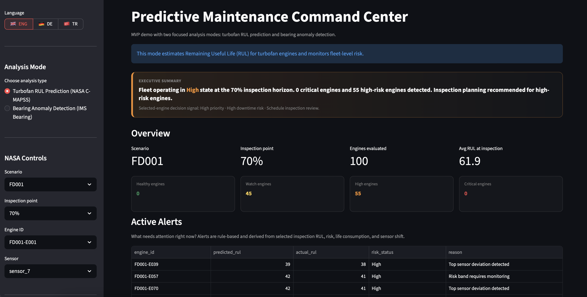
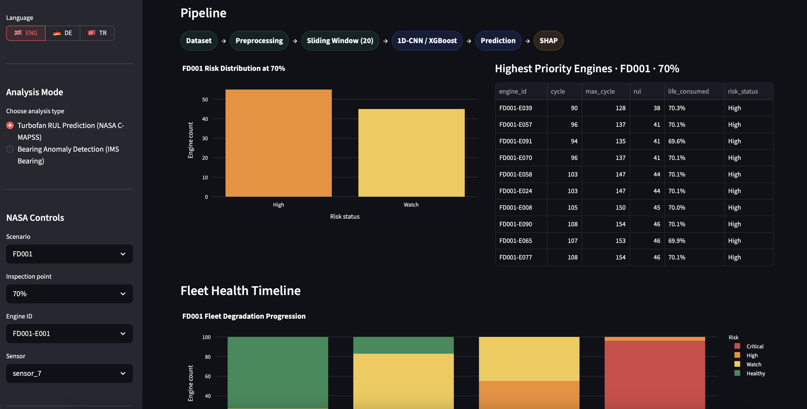
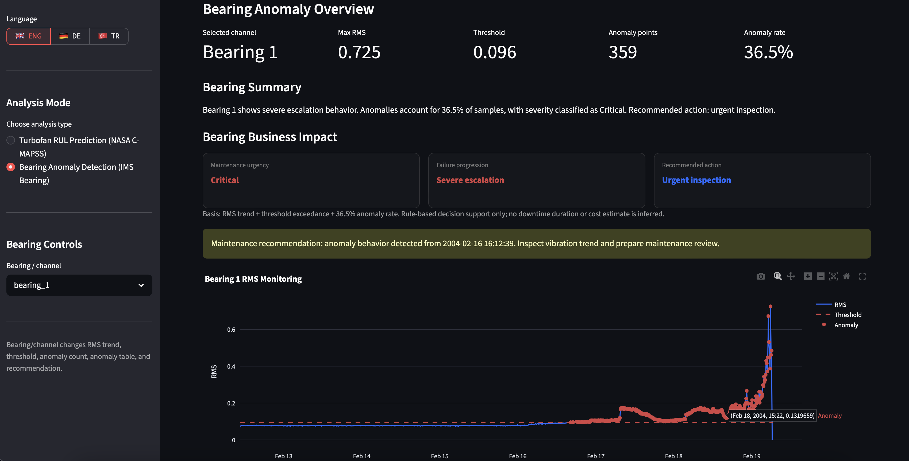

# Predictive Maintenance Command Center

Interactive Streamlit dashboard for a predictive maintenance thesis demo.

The app presents two focused workflows:

- NASA C-MAPSS turbofan Remaining Useful Life (RUL) monitoring
- IMS Bearing anomaly detection with operational decision support

It is designed as a portfolio/demo artifact, not a production monitoring system. RUL estimates are deterministic demo estimates based on saved experiment artifacts; they are not live model inference.

## Features

- Fleet risk overview and alert center
- Engine-level inspection point simulation
- RUL trend and sensor behavior analysis
- Explainability panel with saved thesis artifacts
- Bearing RMS anomaly monitoring
- Bearing business impact and maintenance urgency summary
- Language switcher: English, German, Turkish

## Screenshots

### NASA Fleet Monitoring



### ML Pipeline and Fleet Risk Timeline



### Bearing Anomaly Detection



## Run Locally

```bash
python -m venv .venv
source .venv/bin/activate
pip install -r requirements.txt
streamlit run app.py
```

## Data

The `data/` directory contains processed, dashboard-ready extracts derived from public NASA C-MAPSS and IMS Bearing datasets. The `figures/` directory contains saved thesis experiment artifacts used for explainability context.

## Deployment

This repository is ready for Streamlit Community Cloud. Set the app entry point to:

```text
app.py
```
